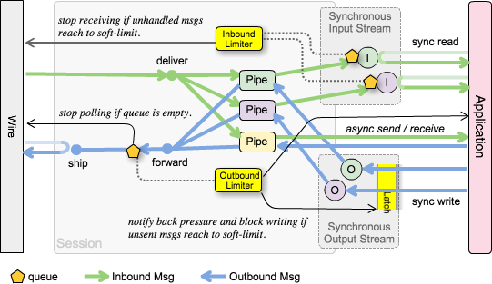

# Message Flow Control

## Back Pressure and Circuit Break

分散システムでのノード間のメッセージ交換はそれぞれのノードが並列動作していることから非同期で行われます。この非同期のメッセージングはブロッキングを伴うキューを介在させることでアプリケーションからは同期処理として使用することができます。しかしメッセージの受信速度が処理速度を上回り続けることによってキューが一時的に保持するメッセージ量が増大します。この輻輳によってリソースの欠如から意図しないアプリケーションダウンを招く可能性があります。

asterisque では同期-非同期間の調整で輻輳による問題が発生しないよう、セッションの入出力キューに対して 2 段階の閾値 Soft Limit, Hard Limit を設定することが出来ます。

### Soft Limit

asterisque は第一段階の閾値としてセッション上に滞留している未入力または未出力のメッセージが **Soft Limit** に達した時にキューの入力方向へ停止要求を通知します。この要求は自動的に回復可能であり、未処理メッセージ数が soft limit を下回ると再開要求が通知されます。

Soft Limit による制御はバックプレッシャー (背圧) による通信の輻輳制御と同じです。

asterisque で InputStream を使用して同期入力を行う時、各 InputStream が保持するキューの未処理メッセージ数のセッションごとの合計が Soft Limit に達した場合、非同期 I/O 実装である Wire に対して入力停止要求を出します。

この入力停止要求は非同期 Socket における `SelectionKey.OP_READ` の削除を意図しています。Wire 実装が Read を停止することで下層のネットワークにバックプレッシャーがかかり通信相手のメッセージ送信を停止させます。

InputStream を使用せず Pipe から非同期でメッセージ到着の通知を受ける場合はメッセージのキューが存在しないためメッセージが未処理の状態で滞留することはありません。しかし並行する同期入力によるバックプレッシャーの影響で非同期メッセージの受信も停止します。

出力のケースでは同期、非同期にかかわらずメッセージは送信キューに一時保存され下層の Wire が送信可能になった時に取り出され送信されます。送信キューの未送信メッセージ数の合計が Soft Limit に達した場合、セッションを共有する全ての OutputStream への同期出力は I/O ブロックに入ります。非同期のメッセージ送信を停止する手段としてセッションからバックプレッシャーの通知を行うだけで非同期送信の処理をブロックすることはありません。

Soft Limit による停止要求に従うかはアプリケーション及び Wire の実装依存です。

### Hard Limit

第二段階の **Hard Limit** はアプリケーション実装または Wire 実装がが停止要求に従わなかった場合の保安措置として強制切断を行う閾値です。Wire を強制的にクローズすることにより実行中の全ての処理は abort しキューに滞留していたメッセージはクリアされます。

アプリケーションや Wire が Soft Limit によるバックプレッシャーを実装したとしても Soft Limit と Hard Limit にクリアランスを設ける必要があります。非同期環境でキューの Soft Limit を厳守するには処理の一部を同期化し恒常的なパフォーマンス劣化を許容する必要があります (ロックフリーにできるかも知れませんが現状そう実装されていません)。asterisque では Soft Limit の厳密さよりパフォーマンスを優先し、Soft Limit を超えるメッセージをキューに追加しているためです。

## Function Call Priority

asterisque はリモートの Function を呼び出す時にその実行の優先度を指定することが出来ます。asterisque 実装はこの優先度に基づいて処理を実行するプロセスやスレッド、あるいは転送過程で介在するキュー内でのメッセージの処理順序などを優先順位付けることができます。

クライアントは Open メッセージに優先度を指定することができます。この値は Close メッセージが発生するまでパイプの優先度として不変です。サーバやメッセージを中継するスタックはこの優先度を実際の処理優先度のためのヒントに使用することが出来ます (そして無視することもできます)。優先順位の指定によりどのような動作となるかは実装依存です。

攻撃的な処理を回避するため、優先度は同一セッション内で並行して実行される Function 呼び出しに対しての相対値とみなされます。また優先度によって同一パイプ上で送受信されるメッセージの順序が入れ替わることはありません。

## <a name="MessageLossRate"><a>Message Loss Rate

(未実装)

asterisque では省略可能なメッセージに対して欠損可能率を指定することができます。アプリケーションが重要でないメッセージの欠損を許容することでストリーミングでの輻輳と品質を調整する事を目的としています。

欠損可能率は個々の Block メッセージに指定することができ、Back Pressure が発生する時や従量課金の回線を使用する場合などで最適となるように評価されます。欠損判定を生き残ったメッセージは 2 回目以降の判定を受けないように欠損可能率が 0% に再設定されます。

メッセージの欠損は実装依存ですが、全ての実装は欠損可能率以上の品質を保証しなければなりません。

